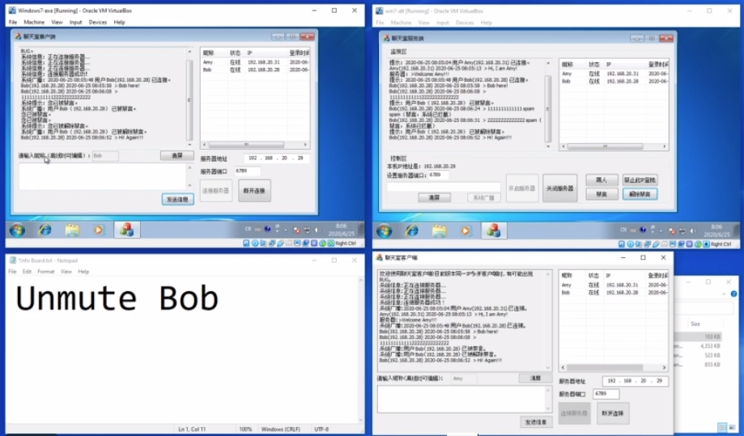

# LAN-Chatroom

Can be used for instant group messaging in local networks such as WiFi environment.

Video Demo: [Vimeo](https://vimeo.com/432340947)

Executable File Download: [Google Drive](https://drive.google.com/drive/folders/1GIUq3bkjwNNiYL4O-b1feZhQLXh_b3vu?usp=sharing)

Features:
- Server-Client mode socket programming
- Server can broadcast messages
- Server can mute and unmute specific clients
- Server can dismiss specific clients

## Known Issues

- When an user mulit-boxes more than one clients on the same device with the same IP address, the user list behaviors abnormally.
- When an user mulit-boxes more than one clients on the same device with the same IP address, mute/unmute functionality behaviors abnormally.

# 局域网聊天室

可以被用于局域网内（例如WiFi网络环境下）的即时通讯。

演示视频：[BiliBili](https://www.bilibili.com/video/BV1JT4y1E7TR/)

可执行文件下载：[Google Drive](https://drive.google.com/drive/folders/1GIUq3bkjwNNiYL4O-b1feZhQLXh_b3vu?usp=sharing)

功能：
- 服务器/客户端网络通信
- 服务器可以广播消息
- 服务器可以对用户禁言和解除禁言
- 服务器可以踢人

## 已知问题

- 当用户在同一个IP地址下多开客户端时，用户列表出现异常。
- 当用户在同一个IP地址下多开客户端时，禁言/解除禁言功能出现异常。