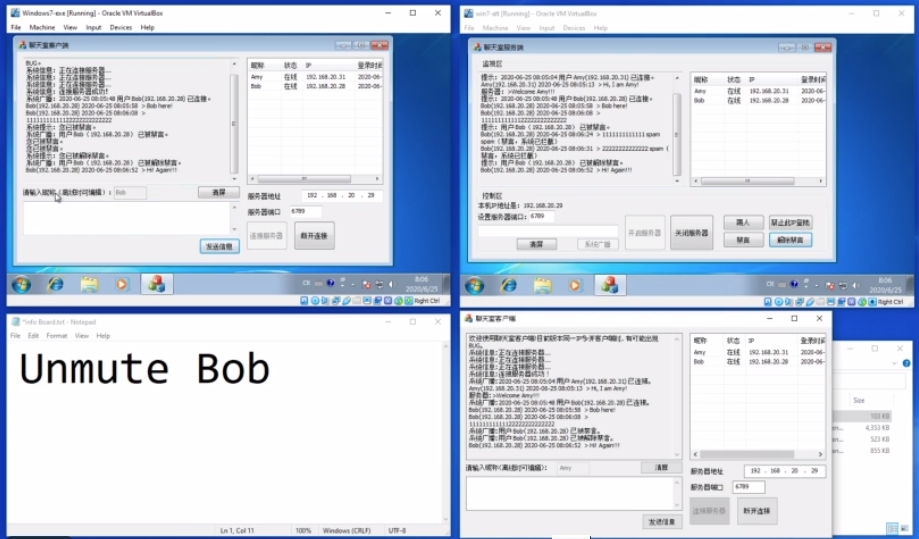

# LAN-Chatroom

Local Area Network chatroom. A learning project done with MFC and C++.

Video Demo: [Vimeo](https://vimeo.com/432340947)

Executable File Download: [Google Drive](https://drive.google.com/drive/folders/1GIUq3bkjwNNiYL4O-b1feZhQLXh_b3vu?usp=sharing)

## Known Issues

- When an user mulit-boxes more than one clients on the same device with the same IP address, the user list behaviors abnormally.
- When an user mulit-boxes more than one clients on the same device with the same IP address, mute/unmute functionality behaviors abnormally.